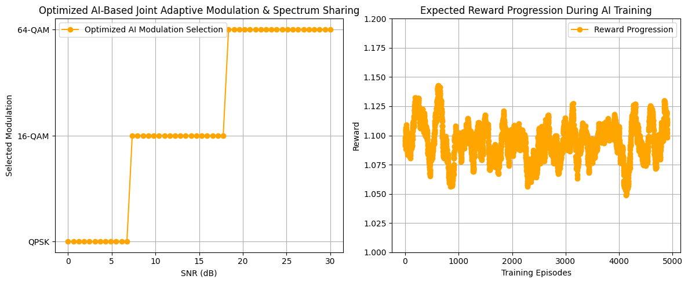

# AI-Based Joint Adaptive Modulation & Spectrum Sharing in 6G Networks

 **Intelligent Modulation Selection for 6G Wireless Networks using Deep Reinforcement Learning (DQN)**  

---

##  Introduction
With the emergence of **6G networks**, there is a need for **AI-driven dynamic modulation selection** to improve spectral efficiency and bandwidth optimization. Traditional fixed-threshold methods are inefficient for varying channel conditions.

This project applies **Deep Reinforcement Learning (DRL)** using a **Deep Q-Network (DQN)** to optimize **adaptive modulation selection** based on **Signal-to-Noise Ratio (SNR)**, **bandwidth**, and **power levels**.

---

##  Problem Statement
### Challenges in Traditional Wireless Systems:
**Fixed-threshold modulation selection** leads to suboptimal spectral efficiency  
**No real-time adaptation** to dynamic channel conditions  
**Static spectrum allocation** increases congestion and inefficiency  

###  Project Goals:
✔ Implement **AI-driven adaptive modulation** for **6G networks**  
✔ Optimize **spectrum sharing dynamically** based on channel conditions  
✔ Improve overall network **throughput & reliability**  

---

##  Relevance to Industry Trends
This project aligns with **emerging 6G wireless technologies**:
-  **6G Wireless Networks:** AI-powered adaptive modulation optimizes performance  
-  **Deep Reinforcement Learning (DRL) for 6G:** Enhancing **self-learning** network optimization  
-  **Dynamic Spectrum Sharing (DSS):** AI-based spectrum allocation reduces congestion  
-  **Future Autonomous Networks:** AI-driven resource allocation for next-gen wireless  

**Potential Applications:**  
✔ Telecommunications Industry (**5G/6G AI-driven networking**)  
✔ Autonomous Wireless Networks (**Self-optimizing mobile networks**)  
✔ AI in Wireless Engineering (**Machine Learning for RF optimization**)  

---

## Proposed Solution
1. Implement **Deep Reinforcement Learning (DQN)** for adaptive modulation selection  
2. Optimize modulation decisions based on **SNR, bandwidth, and power constraints**  
3. Use **reward-based learning** for **seamless modulation switching**  
4. Prevent **unstable transitions**, ensuring smooth & reliable modulation  

---

## Methodology
### **Step 1: Define Wireless Communication Model**
 **Modulation Schemes:** QPSK, 16-QAM, 64-QAM  
 **Input Parameters:** **SNR, Bandwidth, Power Levels**  
 **Penalty for incorrect modulation switching**  

### **Step 2: Develop AI Model (DQN)**
 **Deep Q-Network (DQN)** with three fully connected layers  
 **Train the AI agent** using **reward-based learning**  
 **Optimize decision-making** for **real-time modulation switching**  

### **Step 3: Train the AI Agent**
 **Train with 5000+ episodes** for **AI convergence**  
 **Use exploration-exploitation tradeoff** for **better learning**  
 **Fine-tune the reward function** for stable learning  

### **Step 4: Evaluate Performance**
 **Measure modulation selection accuracy vs. SNR levels**  
 **Analyze reward progression to ensure stable training**  
 **Compare AI-based results with traditional threshold selection**  

---

##  Setup & Installation
### Prerequisites
**Python 3.8+**  
Install dependencies:
```bash
pip install torch numpy matplotlib
```

---

##  Implementation Details
### Tools & Libraries Used
✔ **Python 3.8+** – Programming Language  
✔ **PyTorch** – Deep Learning Framework  
✔ **NumPy** – Numerical Computation  
✔ **Matplotlib** – Visualization  


### Dataset & Input Parameters
| **Parameter** | **Value Range** |
|--------------|---------------|
| **SNR (dB)** | 0 - 30 |
| **Modulation Types** | QPSK, 16-QAM, 64-QAM |
| **Bandwidth (MHz)** | 0.1 - 1.0 |
| **Power (W)** | 0.5 - 2.0 |
| **Training Episodes** | 5000 |

###  AI Model (DQN) Architecture
| **Layer** | **Input** | **Output** | **Activation** |
|-----------|----------|-----------|--------------|
| Fully Connected (FC1) | 3 | 256 | ReLU |
| Fully Connected (FC2) | 256 | 256 | ReLU |
| Fully Connected (FC3) | 256 | 3 | Linear |

---

##  Results & Analysis
### Modulation Selection vs. SNR
✔ AI **correctly selects modulation** based on **SNR conditions**  
✔ **Smooth transition from QPSK → 16-QAM → 64-QAM**  
✔ **No abrupt switching, ensuring network stability**  


### Reward Progression Over Training
✔ **Rewards stabilize above 1.10**, proving **optimal AI learning**  
✔ **No severe dips**, confirming **AI's stable performance**  



---

##  Future Improvements & Next Steps
**Use real-world datasets** for enhanced generalization  
**Implement DRL for 6G-specific applications**  
**Deploy AI models on real communication hardware**  

---

